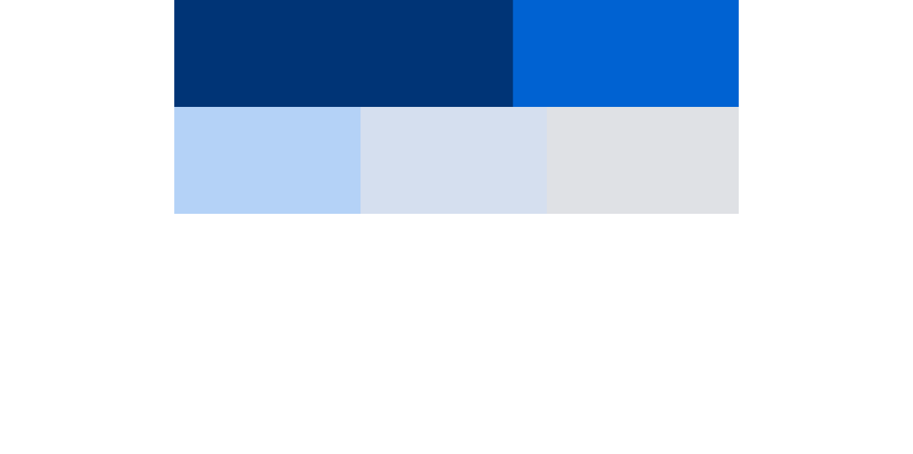
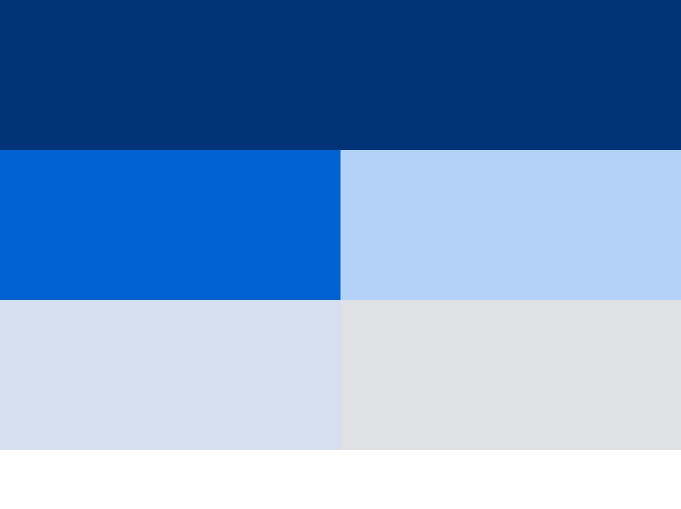
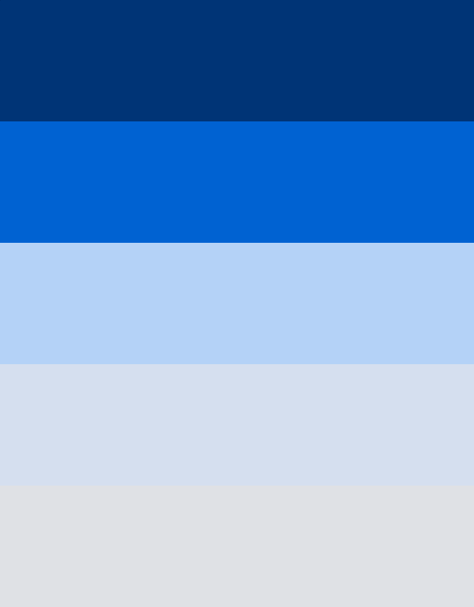

## Mostly Fluid Pattern Challenge

## Context

Responsive Design patterns are used to make a web page responsive across various devices of varying screen sizes.Most design patterns will use breakpoints to adapt for different screen sizes. A Breakpoint is the point at which a different CSS will be applied, usually through a media query, to optimize the design for the user’s viewport. A good example of a breakpoint would be one where your layout has to change from two columns to four columns from one device to another.

In "Mostly Fluid" Pattern, the core structure of the layout really doesn't change until the smallest screen width. Instead, the design mostly relies on fluid grids to adapt to a variety of screen sizes.

On large or medium screens, it usually remains the same size, simply adjusting the margins on wider screens.On smaller screens, the fluid grid causes the main content to reflow, while columns are stacked vertically. One major advantage of this pattern is that it usually only requires one breakpoint between small screens and large screens.

## Challenge

Create a Web Page which resembles the images below which is mostly fluid in responsiveness to a variety of screen sizes using Mostly Fluid Pattern.

### Desktop Image

### Tab Image

### Mobile Image

## Details
1. All the assets required can be found in the `./assets` folder